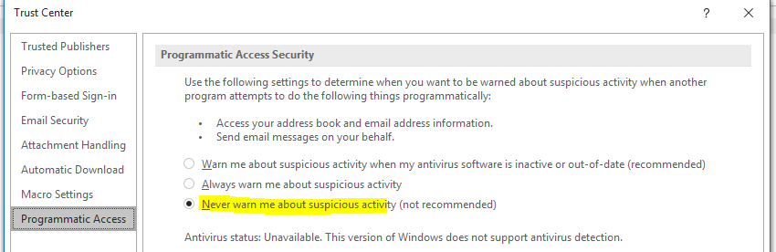

# eml2doc
CLI tool that uses MS Outlook Interop to convert EML file to DOC.

Can easily be switched to generate HTML or MHT output.

DOC file can in turn be converted to PDF using MS Word Interop for example.

## Prerequisites
1. MS Outlook installed.
1. Make sure that your OS/account is configured so that you can double click an EML file and Outlook launches. Outlook needs to be the default for EML files.
1. Allow warning free Programmatic Access to Outlook

